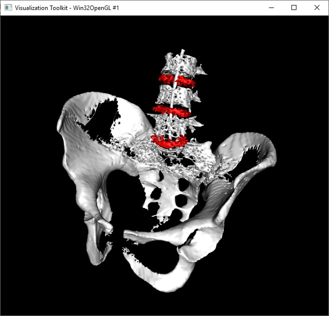
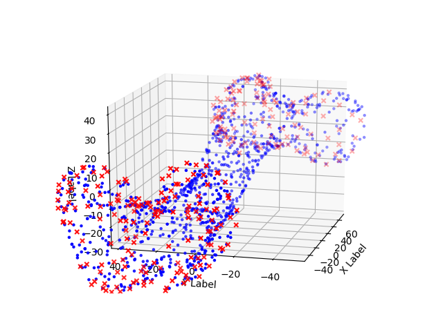

# cas-assignment #
Assignment for the Computer Assisted Surgery course @ University of Bern

## Installation ##

* Install Conda and VSCode
* `conda env create --file environment.yml` use the Conda terminal!
* `activate cas` use the Conda terminal!

## Run a File ##

Using `python cas\test_installation.py`

# Assignments #

## Assignment 1 - Planning ##

> Result of the planning assigment [output.txt](assignments/planning/output.txt)

There are many ways of implementing region growing algorithms for image segmentation. The two most famous algorithms are Flood fill and the Watershed algorithm. Both have its pros and cons. As Flood fill is fast but less smooth, Watershed points with smooth but slower processing. The current implementation in this assignment is based on the Flood fill algorithm. It was much easier to implement and it is also fast. Additionally, the algorithm would provide a radius parameter. In our case, this leads to much worse results as the resolution of the data is very narrow.
So the main point in our algorithm is to choose a neighbor with a radius of one and compare it with the seed point. The sensitivity parameter in the algorithm defines how much the intensity value of the voxel can differ from this seed point. If it's in the range it becomes a candidate for further explorations of additional neighbors. So in our algorithm, every voxel in the very neighborhood can only differ with an absolute value of 40.
On your segmentation mask, two vertebrae are connected by 1 voxel. 

### Which morphological operator could you use to separate these two regions? ###
The most basic morphological operations are dilation and erosion. In this case, an erosion-based algorithm would be the most suitable, as it groups voxels with similar values. The structure, for example, the disks in the spinal cord have small spaces in between them. That is enough for the algorithm to group them.

### Your CT image has salt & pepper noise. How would you preprocess the image to improve your segmentation? ###
A median filter or a Gauss filter would come handy in this situation. The Gausfillter would make the noise and the whole image blurry. The median filter can handle the noise much better and in the end, the noise is almost not visible any more.

### You want to plan a trajectory for a pedicle screw placement on your 3D model. What information do you need to define this trajectory? ###

From an imaging perspective, structures with high intensity are interesting for the planning as it could indicate veins, nerves or bones. So good segmentation is mandatory to find a clear path to the goal.

### Which algorithm can you use to get a surface model from your segmentation? ###
The keyword is edge detection. The surface of an object separates two intensity region in the body. An example would be bone and muscle. Many algorithms, such as morphological or gradient based can be used.

### If you downsample your 3D CT image by a factor of 2 in all dimensions, how much faster or slower will your algorithm get? ###
Let's imagine a cube with the edge of 100 by 100 by 100. The cube would have a volume of 100 to the third power. This equals to 100000. So by shorting all edges by half, wight would equal to a cube of 50 by 50 by 50 with a volume of 125000. The volume correspondents to our voxels in our image. Cutting the edge by half gives us 8 times fewer voxels. So an algorithm would be 8 times faster, as it just has to process an 8th.

## Assignment 2 - Planning ##
    Calibtration matrix T
    [[  1.           0.           0.         208.41819488]
    [  0.           1.           0.          -0.64329634]
    [  0.           0.           1.         -33.13140004]
    [  0.           0.           0.           1.        ]]
    Offset vector p_t:
    [[208.41819488]
    [ -0.64329634]
    [-33.13140004]]
    Error of T
    0.0005346266115642019
    Successful

> Result of the tool calibration assigment [output.txt](assignments/toolcalibration/output.txt)

### In which coordinate system is the vector Pt ###
Pt is in the marker coordinate system.
### Write down the formula to get the tip of the pointer in the camera coordinate system ###
Pp = Pt + Fi
### Where does the error in your result come from (what you get is not the exact solution which is provided)? ###
There are different influencing factors. It begins with the design of the rigid body and can come down to the update rate, the sensor calibration and more. All these factors give us the error in the result.
### How many degrees of freedeom can you calibrate with pivoting? Which ones are missing? ###
There are six degrees of freedom (6DoF) to the freedom of movement of a rigid body in three-dimensional space.

**Translational envelopes:**
* Moving forward and backward on the X-axis. (Surge)
* Moving left and right on the Y-axis. (Sway)
* Moving up and down on the Z-axis. (Heave)

**Rotational envelopes:**
* Tilting side to side on the X-axis. (Roll)
* Tilting forward and backward on the Y-axis. (Pitch)
* Turning left and right on the Z-axis. (Yaw)

**Check**

> Six degrees of freedom - https://en.wikipedia.org/wiki/Six_degrees_of_freedom

DoF | Explanation
--- | ---
Surge | No, the marker can not move forward and backward
Sway | No, the marker can not move right and left
Heave | No, the marker can not move up and down
Roll | Yes, the marker can roll
Pitch | No, the marker can not pitch
Yaw | Yes, the marker can Yaw

### If your instrument is non-rigid (e.g. a needle) your Pt is off if your instrument is bent. How can you overcome this issue? ###
One could optical sensor linkages to measure torsion and flexion of fibre optic cable to determine position and pose along the entire length of the device. It is also possible to track the shape of the device itself.

## Assignment 3 - Registration ##

> Result of matched points in 46 iterations - [output.txt](assignments/registration/output.txt)
### What happens if you use an identity as initial pose? ###
An identity as initial pose will lead to a local minimum. The desired result is a global minimum.
### Describe two methods, how you can acquire the target data in the OR. ###
To get data, you can use anatomical landmarks, surfaces or artificial fiducials. Best results can be achieved with surfaces with a high mesh density. These data points can come from an MRI, CT or even a stereo camera.
### What is the minimum number of points you need for paired points matching? ###
3 at least. The difficulty of those landmarks is, that there are difficult to find. Usually, there will be more errors in finding the points.
### If the patient moves, your calculated transformation is not accurate anymore. How can you prevent this? ###
You can attach a mark to the patient (e.g. bone) to have a reference point which you then can calculate your errors form. So, you will always have a good transformation with fewer errors. These are also called fiducials.
### We are in ENT surgery now. Which anatomical landmarks do you take for paired points matching and which surface for ICP. Explain why? ###
The difficulty in ENT surgery is to get landmarks close to the workspace of the surgeon. This is quite difficult, because of close landmarks are difficult to add without surgery, which allows us to place landmarks inside of the body. For an accurate result is the closer the better the rule of thumb from an error perspective view.